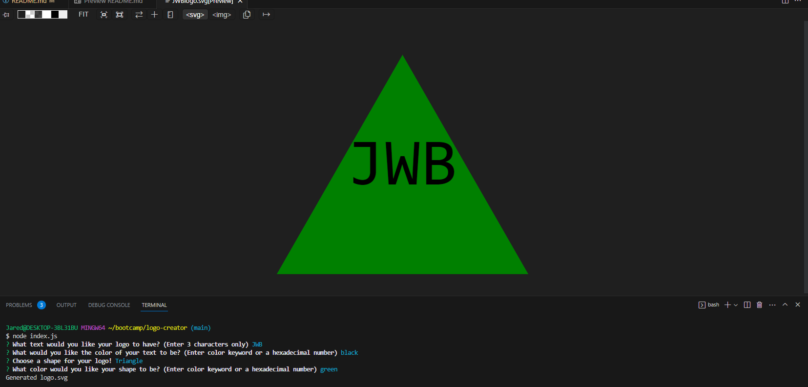

# Logo Creator

## Description
Creating this project gives me insight on how to use tests and become familiar with fs, inquirer, svg, and jest! Using this project will easily help you create a custom logo for all of your business needs! I've learned how to integrate .svg into my coding and how to create a shape using JavaScript.

## Table of Contents
- [Installation](#installation)
- [Usage](#usage)
- [License](#license)
- [Credits](#credits)
- [Tests](#tests)
- [Questions](#questions)

## Installation
Clone this code to your computer using this command: ```git clone git@github.com:Turbdorb/logo-creator.git```

Afterwards install Inquirer and Jest using this command: ```npm i```

## Usage
Open an integrated terminal and use this command: ```node index.js```

Answer all of the questions prompted. The logo will be generated in the examples folder.

Picture: 

Demo: [Video](https://drive.google.com/file/d/1nzsgpeMrHLCVAahZlbK6CN4eyR0yfMrP/view)

## License
[](https://opensource.org/licenses/MIT)

This application is covered under the MIT license.

## Credits
MDN SVG webdocs used: <ul>
                            <li>https://developer.mozilla.org/en-US/docs/Web/SVG/Tutorial/Texts</li>
                            <li>https://developer.mozilla.org/en-US/docs/Web/SVG/Tutorial</li>
                            <li>https://developer.mozilla.org/en-US/docs/Web/SVG/Tutorial/Basic_Shapes</li>
                        </ul>
## Tests
Three tests can be run using this command: ```npm test```

## Questions
GitHub: [turbdorb](https://github.com/turbdorb)

Email: <brymerjared@gmail.com>
